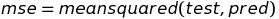
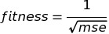

## Problem Statement

In this following selection , we have applied Genetic algorithm in the field of machine Learning. Given a set of feaures <i>n</i> and given the condition that we must selection <i>m</i> features from these <i>n</i> features such that the linear regression prediction of the test set using these features result in the least possible mean squared errors. The details of the datasets and the Libraries (non-trivial) used are follows:

- <b>Dataset Used</b> : <a href="http://archive.ics.uci.edu/ml/datasets/communities+and+crime"> Communities and Crime Dataset, UCI </a>
- <b>Libraries Used</b> : Pandas, Scikit-Learn

## Approach

We used Genetic Algorithms to solve this problem. The walkthrough of our code has been provided below:

<b>Step 1</b>: Import the libraries

- Scikit Learn
  - Linear Regressor
  - Test train split
  - Mean Squared Error

- Genesis
  - Abstract Solver

- Numpy
- Matplotlib
- Pandas

<b>Step 2</b>: Preprocess the data

Preporcessing of the data has been done using Pandas. The data preprocessing has been done by first reading ```communities.data``` and every row has been assigned with a header 
from ```communities.names```. After doing this, we have removed features which would not affect the outcome like ```states,countries,communityname,community```. After this process
is done, we removed cells and headers which have empty cells. We now move forward to define the fitness function.

<b>Step 3</b>: Define fitnesss function. The fitness function for a given set of chromosomes is defined as follows:


\
We pass each set of chromosome's indices corresponding to the appropriate headers into a Logistic Regressor. We then report the fitness as follows:
\



The code snippet for the fitness function has been provided here:

```python
def fitness_func(chromosome):
    columns = []
    for i in range(len(x_train.columns)):
        if i in chromosome:
            columns.append(x_train.columns[i])
    dist.append(columns)
    training_set = x_train[columns]
    test_set = x_test[columns]
    lg = LinearRegression().fit(training_set.values, y_train.values)
    preds = lg.predict(test_set.values)
    return 100 / np.sqrt(mean_squared_error(y_test.values, preds))
 ```
 
<b>Step 4</b>: Run using our Library! The results after a few convergences in generations have been shown below:


