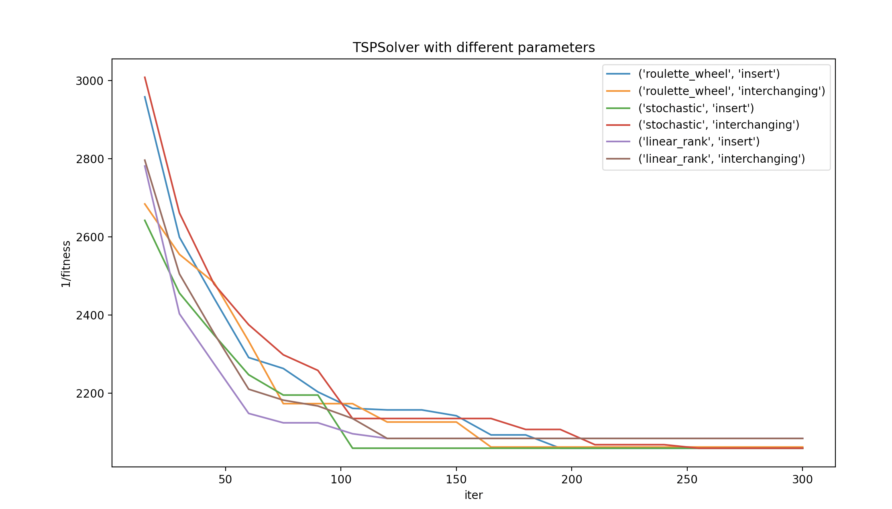

# TSP Solver

The travelling salesman problem attempts to solve the following problem: given a set of nodes and the distances between each pair of nodes, what is the shortest possible route that visits each node exactly once and returns to the origin node?

The walkthrough has been provided below

## Walkthrough

The solver requires a connected graph that specifies the set of nodes and the distances between each node which enables us to solve for the shortest path following the described constraints above. This is to be provided as an adjacency matrix in a text file format.

Solving for the TSP is then just a simple matter of passing the filename as argument to the `test_tsp()` function defined within `TSP.py` which routinely prints the relevant data as the solver converges to a solution.

```python3
test_tsp("file.txt")
```

For greater control over the solver, one can create a `TSPSolver` object (defined in `TSP.py`) for a specific map defined within file `"map.txt"`.

In order to convert the adjacency matrix to python numpy arrays, we import pandas and numpy.
```python3
import numpy as np
import pandas as pd
```

The `TSPSolver` object can then be generated by passing in relevant parameters.

```python3
def gen_tsp(map):
    with open(map) as file:
        info = file.read()
    info = info.split("\n")
    info = [ x.split() for x in info ]
    scores = pd.DataFrame(info)
    scores = scores.to_numpy()
    scores = scores.astype(np.float)
    solver = TSPSolver(
        gene_size=len(scores)-1,
        fitness_func=lambda a : tsp_fitness(a , scores),
        pop_cnt=600, # population size (number of individuals)
        max_gen=500, # maximum number of generations
        mutation_ratio=0.4, # mutation rate to apply to the population
        selection_ratio=0.6, # percentage of the population to select for mating
        selection_type="stochastic",
        crossover_type="one_point",
        mutation_type="insert",
        verbose=True,
        cv=0
    )

    return solver
```

Solutions for the specified map can be easily obtained.

```python3
solver = gen_tsp("map.txt")
for curr_data in solver.solve():
    # Process curr_data
```

The comparitive analysis between different selection and mutation combinations have been given below:


